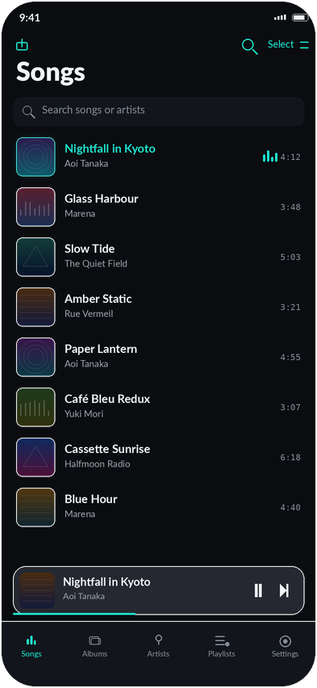
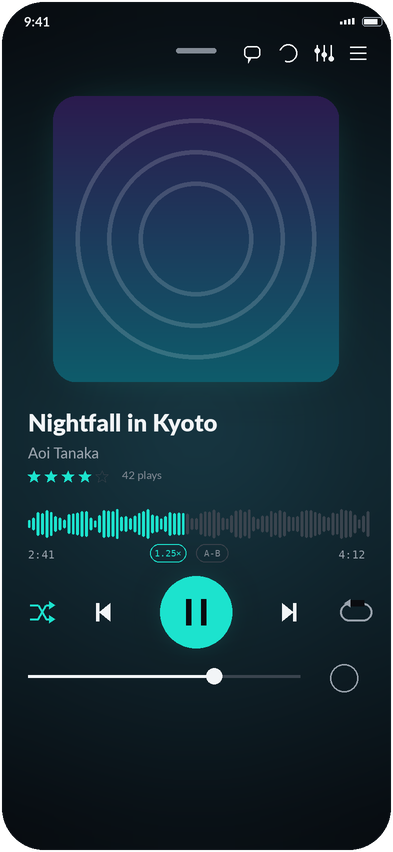
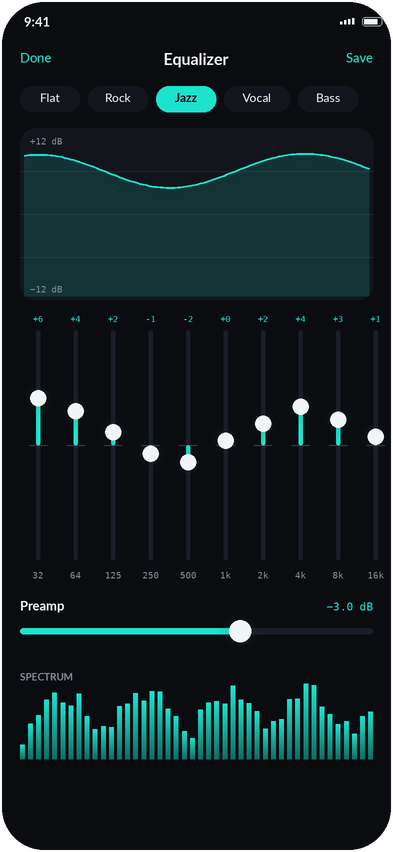
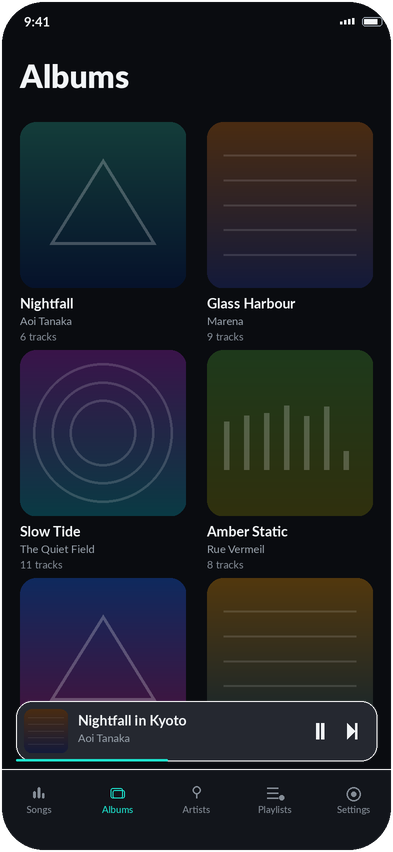

# AuraPlayer

A dark, audiophile iOS music player built in SwiftUI. Near-black surfaces, minimal chrome, and a single glowing electric-cyan accent that keeps the music front and center.

Plays your own files — no streaming, no accounts, no ads, no telemetry.

<p align="center">
  
  
  
  
</p>

<p align="center">
  <sub>Library&nbsp;· Now Playing&nbsp;· Equalizer &amp; spectrum&nbsp;· Albums</sub>
</p>

> The images above are design renders produced from the app's own colour, type
> and spacing tokens. Swap in real device screenshots before publishing.

---

## Features

### Playback

- Dual-node `AVAudioEngine` graph supporting **true gapless** hand-off and **crossfade** between tracks
- Sample-exact gapless scheduling when consecutive files share a sample rate
- Queue with shuffle, repeat (off / one / all), **Play Next** and **Add to Queue**
- **A-B repeat** loop for practising a passage
- **Speed** 0.5×–3× with pitch preserved, and independent **pitch shift** (±12 semitones)
- **Volume normalization** — ReplayGain-style loudness analysis, cached per file
- **Per-track resume** for long files (20 min+), so audiobooks and DJ sets pick up where you left off
- **Session restore** — reopens on the track and position you left, paused
- **Sleep timer** with fade-out, or stop at end of track
- Background audio, lock screen controls, Control Center, and headphone remote

### Sound

- **10-band parametric EQ** (32 Hz – 16 kHz) with adjustable per-band width and preamp
- 9 built-in presets plus user-saved custom presets
- Live **frequency response curve** (Bode plot) that follows the sliders
- Real-time **FFT spectrum analyzer** (Accelerate/vDSP) with bars, line, and mirror modes
- Effect nodes bypass themselves when neutral, so nothing burns CPU doing a no-op

### Library

- Browse by **songs, albums, artists, composers, playlists**, or the raw **folder tree**
- **Global search** across every field at once
- Sort (A–Z / recently added / duration), search, and pull-to-refresh
- **Smart playlists** — rule-based and auto-updating (rating, play count, genre, year, date added…)
- **Star ratings**, automatic **play counts**, and a **listening history**
- **Metadata editor** for titles, artists, albums, genres, years, and cover art — stored as app-side overrides, so your files are never rewritten
- **Batch editing** across a multi-selection
- Automatic artwork lookup for untagged files
- Track **Info** sheet: format, sample rate, bit depth, bitrate, and file size
- **Library maintenance** — duplicate detection, broken-link cleanup, and auto-organise into `Artist/Album` folders

### Getting music in

- Import from the **Files** app (multi-select)
- **Wi-Fi transfer** — the app runs a small HTTP server, so you drag and drop files from any browser on your network, and delete them from there too
- **ZIP archives** unpacked on import
- **M3U / M3U8** playlist import and export
- iTunes/Finder file sharing, and "Open in AuraPlayer" from Safari, Mail, and other apps
- Built-in **download manager** — paste a URL, downloads continue in the background
- Storage management and download history
- **Backup & restore** of playlists, ratings, play counts, and metadata edits

### Lyrics

- **Synced lyrics** (`.lrc`) that scroll with playback — tap a line to seek
- Resolution order: sidecar `.lrc` → embedded tags → **LRCLIB** (free, no API key)
- **Search lyrics online** by hand when tags are wrong, with duration matching to identify the right recording
- Built-in **lyrics editor**: paste the words, then tap along to stamp each line's timing

### Craft

- Every animation respects **Reduce Motion**
- Full **VoiceOver** labelling and **Dynamic Type** support
- Colour tokens verified against **WCAG AA** contrast on every surface
- Skeleton loading states instead of bare spinners
- Custom-drawn icons: a play/pause glyph that morphs between shapes, a record that spins while playing and holds its angle when paused, and a now-playing indicator that settles flat on pause

---

## Tech

| | |
|---|---|
| **Language** | Swift 6 + SwiftUI |
| **Architecture** | MVVM, `@MainActor`-isolated view models |
| **Minimum target** | iOS 26+ |
| **Audio** | `AVAudioEngine`, `AVAudioUnitEQ`, `AVAudioUnitTimePitch` |
| **DSP** | Accelerate (vDSP) for FFT, waveform, and loudness analysis |
| **Networking** | `URLSession` background downloads, `NWListener` for Wi-Fi transfer |
| **Charts** | Swift Charts |
| **Tests** | Swift Testing (`@Test` / `#expect`) |

**Formats:** MP3, M4A/AAC, ALAC, FLAC, WAV, AIFF. DSD files (`.dsf` / `.dff`) are detected and listed but not decoded — the engine is built on `AVAudioFile`, which can't read them.

**Dependencies:** none. Everything is first-party Apple frameworks.

---

## Design

A **dark audiophile** aesthetic, dark mode only, with a cyan glow as the signature effect. The palette is near-black and cool-tinted (`#0A0C10` background, `#1CE3CE` accent) so album art is the brightest thing on screen.

Typography is built on text styles rather than fixed point sizes, so everything scales with the reader's Dynamic Type setting. Design decisions and exact hex values live in `DESIGN_NOTES.md`; the implementation is under `DesignSystem/`.

---

## Project structure

```
AuraPlayer/AuraPlayer/
├── Models/          # Track, Album, Artist, Playlist, Lyrics, EQPreset…
├── ViewModels/      # Player, Library, Playlists, Stats, Overrides
├── Views/           # Screens and components
├── Services/        # Audio engine, EQ, spectrum, scanner, downloads, lyrics
├── DesignSystem/    # Colours, fonts, spacing, motion, reusable components
└── Resources/
```

Notable services:

| File | Responsibility |
|---|---|
| `AuraAudioEngine` | Dual-player node graph, crossfade, gapless, speed/pitch, seeking |
| `EQEngine` | 10-band EQ state, presets, persistence |
| `SpectrumAnalyzer` | Realtime FFT tap, lock-free hand-off to the UI |
| `LibraryScanner` | Recursive Documents scan and metadata reading |
| `AlbumGrouper` | Normalised album grouping shared by every browse screen |
| `LoudnessAnalyzer` | RMS loudness → playback gain |
| `LyricsProvider` | Sidecar → embedded → LRCLIB resolution, plus manual search |
| `SmartPlaylistEngine` | Rule evaluation for auto-updating playlists |
| `WiFiTransferServer` | `NWListener` HTTP server for browser upload and delete |
| `DownloadManager` | Background `URLSession` queue |
| `BackupService` | Export and import of all user data |
| `LibraryMaintenance` | Duplicates, broken links, auto-organise |

---

## Building

```bash
git clone https://github.com/<you>/AuraPlayer.git
cd AuraPlayer
open AuraPlayer/AuraPlayer.xcodeproj
```

Requires Xcode 16 or later and an iOS 26 device or simulator. Build and run with **⌘R** — there are no packages to resolve first.

The project uses Xcode's **file system synchronized groups**, so files added to a folder are picked up automatically without editing the project file.

### Adding music

Drag audio files onto a running simulator, or use the in-app import button. On device, Wi-Fi transfer is usually fastest: open **Settings → Wi-Fi Transfer** and visit the address it shows from a desktop browser.

### Tests

Run with **⌘U**, or:

```bash
xcodebuild test -scheme AuraPlayer -destination 'platform=iOS Simulator,name=iPhone 16'
```

`AuraPlayerTests` covers the pure-logic layers — EQ response maths, `.lrc` parsing, album grouping, and model serialisation. `AuraPlayerUITests` is an XCUITest scaffold.

Audio behaviour that can't be unit-tested (lock screen, AirPlay, background playback, route changes) is verified manually on a device.

---

## Not built yet

An honest list, in rough order of likely value:

- Widgets, Live Activity, and CarPlay — each needs an additional Xcode target
- iCloud sync of ratings and playlists — needs an entitlement
- Last.fm scrobbling — needs an API key
- Headphone crossfeed
- DSD decoding — implementable in pure Swift with vDSP, but the engine's `AVAudioFile` foundation would have to be replaced first
- Writing tags back to files — metadata edits are deliberately app-side, leaving your audio untouched

---

## Licence

See [LICENSE](LICENSE).
